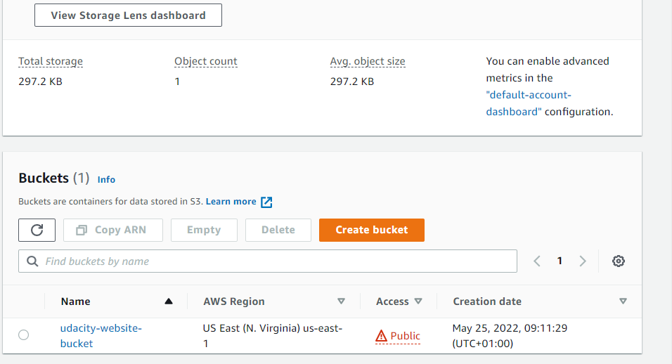
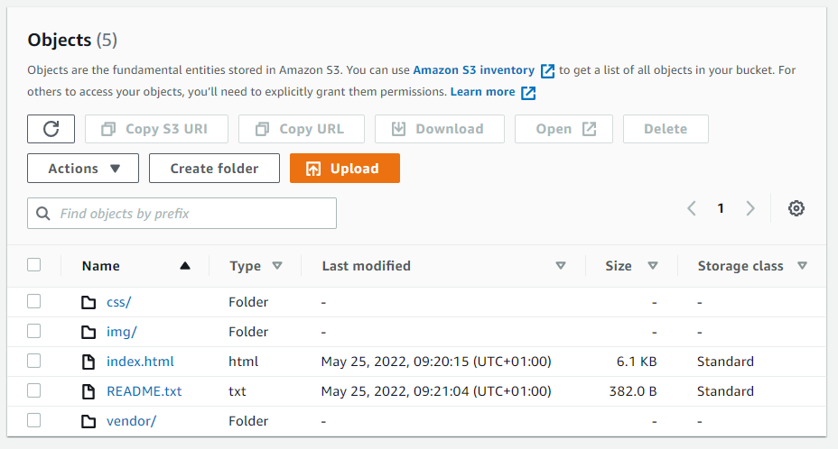
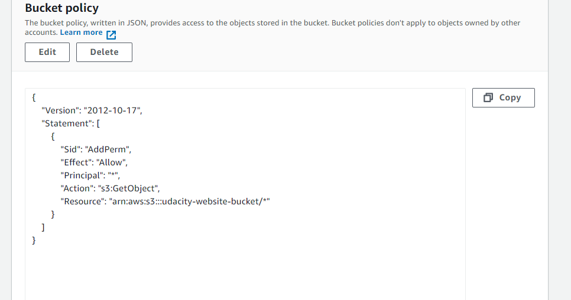
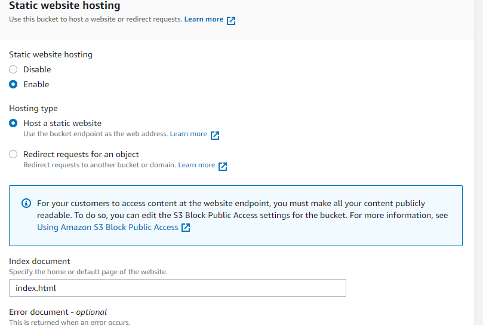
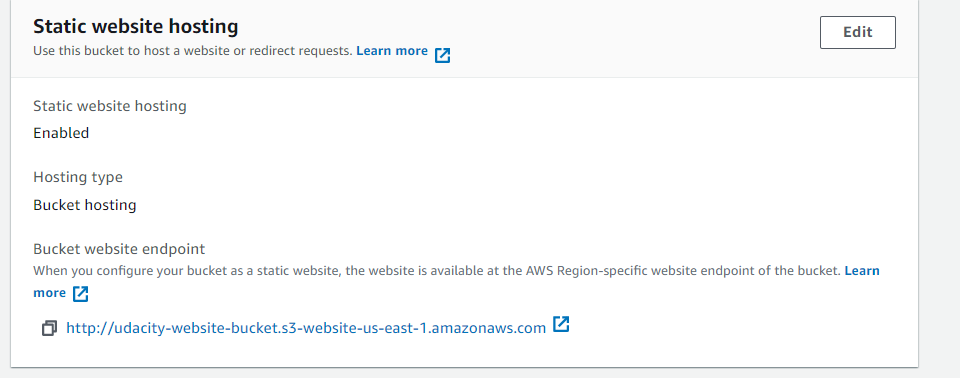
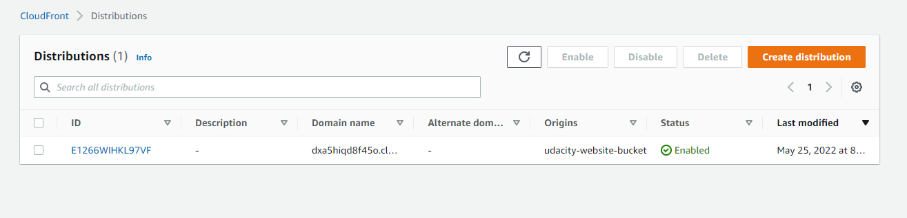

## About The Project

The whole project has two major intentions to implement:

- Hosting a static website on S3 and
- Accessing the cached website pages using CloudFront content delivery network (CDN) service. Recall that CloudFront offers low latency and high transfer speeds during website rendering.

In this project, you will deploy a static website to AWS by performing the following steps:

- I created a public S3 bucket and upload the website files to your bucket.
- I configured the bucket for website hosting and secure it using IAM policies.
- I sped up content delivery using AWS’s content distribution network service, CloudFront.
- I accessed your website in a browser using the unique CloudFront endpoint.

## Steps

1. Created S3 bucket

2. Files uploaded

3. Securing bucket via IAM

4. Configuration of website hosting

5. Static website hosting enabled

6. Cloudfront distribution

## Access points

- Cloudfront domain:

https://dxa5hiqd8f45o.cloudfront.net/

- Access the website via website-endpoint, such as:

http://udacity-website-bucket.s3-website-us-east-1.amazonaws.com/

- Access the bucket object via its S3 object URL, such as:

https://udacity-website-bucket.s3.amazonaws.com/index.html
